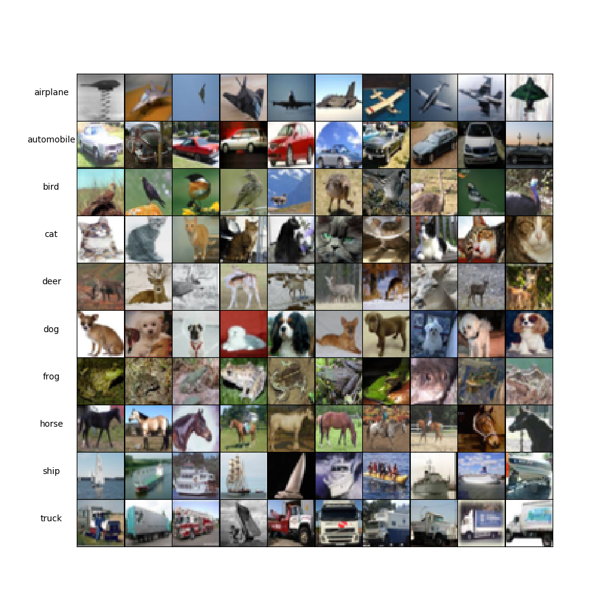
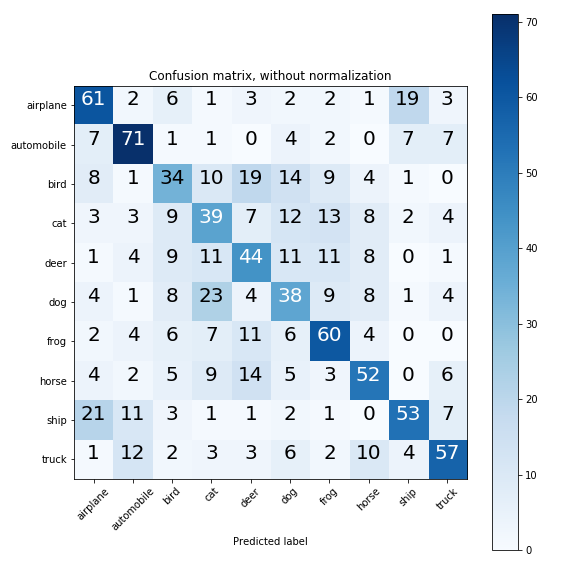
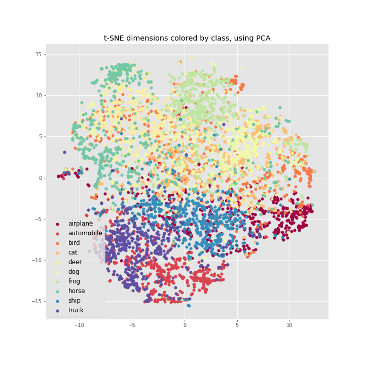
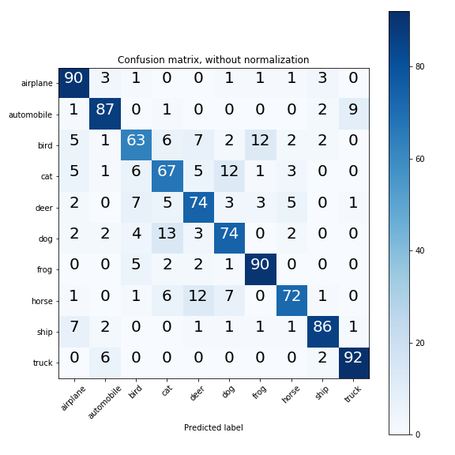

# CIFAR-10-Classifier

Transfer Learning of the CIFAR-10 dataset using VGG16 with a SVM classifier.

# Installation

- Python 3.6.4
- Please see requirement.txt for modules

# Code structure

## Jupyter notebooks
- **Shallow_classifier.ipynb**
  - Feature extractor: HoG
  - Clasifier: SVM
- **Dimensionality_reduction.ipynb**
  - t-SNE
- **Model.ipynb**
  - Feature extractor: VGG16 bottleneck fc2
  - Clasifier: SVM
- **Presentation.ipynb**
  - Look here if you want to see the gist of the project without looking at a lot of code.

## Python files
- **download_data.py**
  - downloads data from https://www.cs.toronto.edu/~kriz/cifar.html and unpacks it
- **extract_data.py**
  - Loads data form batches and saves into '.h5' files
  - *save_file* function intakes 'proportion' argument which determines the size of the dataset. Use 0.1 if you do not have a CUDA enabled GPU, else use 1.
- **features.py**
  - Taken from http://cs231n.github.io/assignments2016/assignment1/
  - Used to extract the histogram of oriented gradients features of each image
- **image_plotting.py**
  - Contains functions used to display images in the presentation jupyter notebook
- **plot_cm.py**
  - plots confusion matrix

# Presentation or here in [this jupyter notebook](presentation.ipynb).
10 random images form each class in the dataset.

## Shallow classifier (benchmark)
- Code executed in [this jupyter notebook](Shallow_classifier.ipynb).
- Test set accuracy = 51 %

| Accuracy | F1-score |
| --- | --- |
| 51 % | 51 % |

## Extracing CNN codes from VGG16
- I have chosen the second fully connected (FC2) layer to extract visual features.
- Code executed in [this jupyter notebook](Dimensionality_reduction.ipynb).
- I have embedded them in 2D via the following dimensionality reduction techniques: PCA, t-SNE

## Training SVM on top of CNN codes
- Code executed in [this jupyter notebook](Model.ipynb).
- Test set accuracy (with bagging) = 80 %

| Accuracy | F1-score |
| --- | --- |
| 80 % | 80 % |

